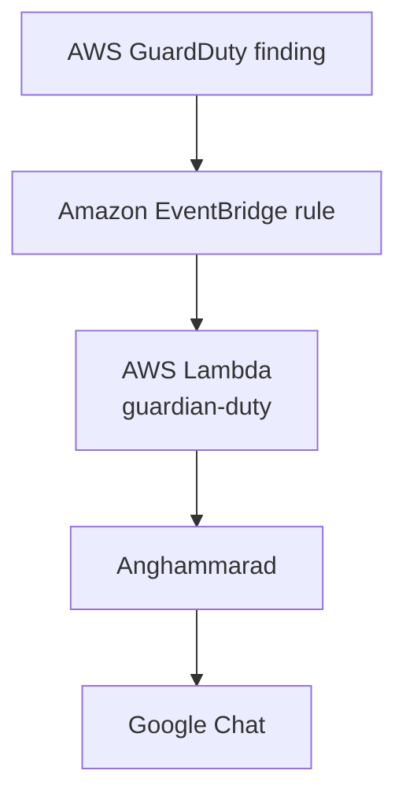

Guardian Duty
=============

Notifications for [AWS GuardDuty](https://aws.amazon.com/guardduty/).

## Overview

Guardian Duty is an AWS Lambda function that monitors GuardDuty findings via EventBridge and sends security alert notifications (via Google Chat) when a **High** or **Critical** finding is detected.

| Severity band | Score range | Notified? |
|---------------|-------------|-----------|
| Critical      | 9.0 – 10.0  | ✅ Yes    |
| High          | 7.0 – 8.9   | ✅ Yes    |
| Medium        | 4.0 – 6.9   | ❌ No     |
| Low           | 0.1 – 3.9   | ❌ No     |

Notifications are delivered using [Anghammarad](https://github.com/guardian/anghammarad).

## Architecture



## Local testing with the CLI

The project includes a CLI entry point that reads an EventBridge event from a file (or stdin) and processes it locally, printing notifications to the console instead of sending them.

### Run with a sample event file

```zsh
sbt "run src/test/resources/test-events/sample-guardduty-event.json"
```

### Run with a custom event

Create a JSON file that follows the EventBridge envelope format and pass it as an argument:

```zsh
sbt "run /path/to/my-event.json"
```

The expected JSON shape is:

```json
{
  "version": "0",
  "id": "...",
  "detail-type": "GuardDuty Finding",
  "source": "aws.guardduty",
  "account": "123456789012",
  "time": "2026-01-01T00:00:00Z",
  "region": "eu-west-1",
  "detail": {
    "schemaVersion": "2.0",
    "id": "abc123",
    "accountId": "123456789012",
    "region": "eu-west-1",
    "severity": 8.5,
    "type": "UnauthorizedAccess:EC2/SSHBruteForce",
    "title": "...",
    "description": "..."
  }
}
```

> **Note:** When running locally the CLI uses `ConsoleNotifications`, so no real notification is sent — output goes to stdout only.

### Generating a real sample event with AWS

AWS can generate sample findings directly in GuardDuty, which is useful both for end-to-end testing alerts in production and for capturing real event JSON to use in local testing.

First, find your detector ID by browsing to the GuardDuty console's settings page or by doing the following:

```zsh
aws guardduty list-detectors
```

Then create a sample finding (adjust the `--finding-types` value as needed):

```zsh
aws guardduty create-sample-findings \
  --detector-id <your-detector-id> \
  --finding-types Exfiltration:S3/AnomalousBehavior
```

This will trigger the EventBridge rule and invoke the Lambda in whichever account/region you run it against, sending a real alert via Anghammarad, if it meets the severity threshold.
